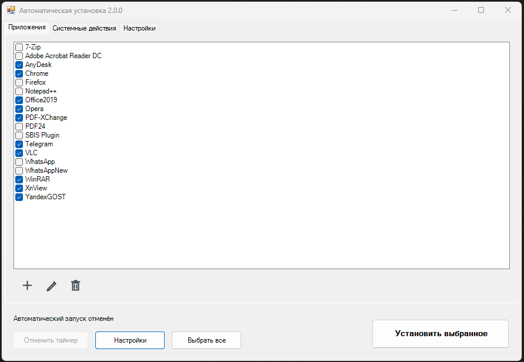
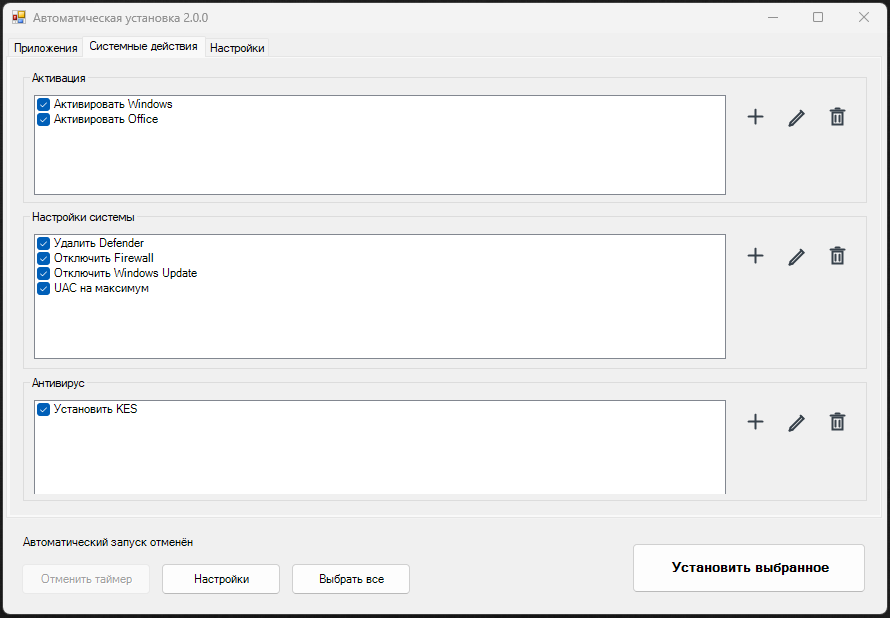
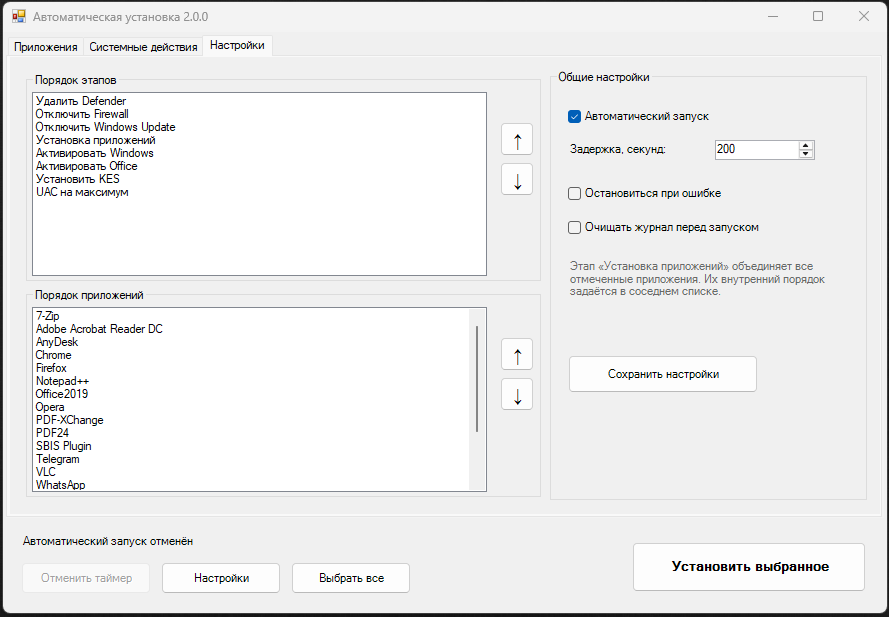

# Windows Setup Automation 2.0

Небольшой автономный установщик для тех случаев, когда Windows уже поставилась, а впереди ещё браузеры, архиваторы, Office, антивирус и привычные настройки.

Я использую его после первого входа в чистую Windows. Сценарий внутри установочного образа ждёт загрузки рабочего стола, находит установочную флешку по метке тома и открывает эту оболочку. Дальше проходит таймер, и выбранные программы выполняются по очереди. Интернет и дополнительные оболочки самому проекту не нужны — всё работает на обычном Windows PowerShell 5.1 и WinForms.

> В репозитории нет установщиков, ключей и лицензий. Здесь находится сама оболочка и примеры. Наполнение каждый собирает под себя.

### Приложения



### Системные действия



### Настройки и порядок выполнения



## Что умеет

- устанавливать EXE и MSI;
- запускать BAT/CMD и PowerShell-сценарии;
- добавлять и редактировать программы прямо из интерфейса;
- искать установщик по маске, например `7z*-x64.exe`;
- менять порядок всех операций;
- запускаться вручную или автоматически по таймеру;
- работать с ISO в режиме только чтения;
- ждать завершения каждого установщика и проверять его код;
- вести общий `InstallLog.txt` на рабочем столе;
- в конце показывать, что установилось, а что нет.

## Быстрый старт

1. Скачайте репозиторий и распакуйте его.
2. Разложите установщики по подпапкам внутри `apps`.
3. Запустите `StartGUI.cmd` или `StartGUI.bat`.
4. Добавьте свои программы кнопкой `+`.
5. Проверьте порядок на вкладке «Настройки».
6. Нажмите «Установить выбранное» или включите таймер.

В публичной конфигурации таймер выключен и ничего не выбрано — случайно отключить себе Firewall сразу после скачивания не получится.

## Как всё разложено

```text
WindowsSetupAutomation/
├── main.ps1
├── installer_config.json
├── StartGUI.cmd
├── apps/       # программы
├── scripts/    # настройки Windows
├── MAS/        # активация Windows и Office
└── KES/        # Kaspersky Endpoint Security
```

Каждый раздел жёстко ограничен своей папкой. Приложение нельзя случайно добавить из `C:\Windows`, а сценарий активации — из `apps`.

## Добавление программы

Например, добавим 7-Zip.

Создайте папку и положите туда установщик:

```text
apps/
└── 7-Zip/
    └── 7z2501-x64.exe
```

На вкладке «Приложения» нажмите `+` и заполните:

```text
Название:       7-Zip
Тип:            Exe
Путь:           apps\7-Zip\7z*-x64.exe
Аргументы:      /S
Коды успеха:    0, 1641, 3010
```

Маска удобна тем, что при обновлении достаточно заменить файл. Конфигурацию менять не придётся. Если совпадений несколько, берётся самый новый файл.

Если установщик не требует параметров, оставьте поле «Аргументы» пустым — оболочка запустит EXE без `ArgumentList`.

Для MSI выберите тип `Msi` и укажите только дополнительные ключи:

```text
/qn /norestart
```

`msiexec /i` оболочка добавит сама.

Если приложению нужна нестандартная логика, используйте PowerShell-обёртку:

- `apps/ExampleInstall.ps1` — короткий универсальный шаблон;
- `apps/Telegram.example.ps1` — реальный пример с поиском свежего установщика, несколькими аргументами, ожиданием завершения, логированием и созданием ярлыка.

Пример не добавлен в очередь автоматически. Скопируйте или переименуйте его под своё приложение, затем добавьте через кнопку `+`.

## Интерфейс

Во вкладке «Приложения» находятся обычные программы. Во вкладке «Системные действия» три отдельных блока:

- **Активация** — папка `MAS`;
- **Настройки системы** — папка `scripts`;
- **Антивирус** — папка `KES`.

Пиктограммы одинаковы во всех блоках:

- `+` — добавить;
- карандаш — изменить;
- корзина — удалить запись из конфигурации.

Файл при удалении записи остаётся на диске.

Во вкладке «Настройки» можно передвигать этапы и приложения стрелками вверх/вниз. Там же настраиваются таймер, очистка журнала и остановка после первой ошибки.

## Активация Windows и Office через MAS

Базовая конфигурация рассчитана на проект [Microsoft Activation Scripts (MAS)](https://github.com/massgravel/Microsoft-Activation-Scripts) от massgravel.

Обёртки уже готовы:

```text
MAS/MAS_WINDOWS.ps1
MAS/MAS_OFFICE.ps1
```

Они запускают `TSforge_Activation.cmd` отдельно для Windows и Office. Чтобы подключить MAS:

1. Откройте [репозиторий MAS](https://github.com/massgravel/Microsoft-Activation-Scripts).
2. Нажмите **Code → Download ZIP**.
3. Распакуйте архив.
4. Откройте папку `MAS` внутри скачанного проекта.
5. Скопируйте из неё папки `Separate-Files-Version` и `All-In-One-Version-KL` в папку `MAS` этого проекта.
6. Не удаляйте находящиеся там `MAS_WINDOWS.ps1` и `MAS_OFFICE.ps1`.

В результате должен существовать файл:

```text
MAS\Separate-Files-Version\Activators\TSforge_Activation.cmd
```

Итоговая структура:

```text
MAS/
├── MAS_WINDOWS.ps1
├── MAS_OFFICE.ps1
├── Separate-Files-Version/
│   └── Activators/
│       └── TSforge_Activation.cmd
└── All-In-One-Version-KL/
    └── MAS_AIO.cmd
```

Для работы автоматической очереди нужен именно `TSforge_Activation.cmd`. Папка `All-In-One-Version-KL` не обязательна, но её удобно оставить для ручного запуска и диагностики.

Сами файлы MAS я сюда не дублирую: так проще получать актуальную версию непосредственно из исходного репозитория. Используйте способы активации в соответствии с лицензиями на ваши Windows и Office.

## Windows Update Blocker

Для отключения обновлений используется Windows Update Blocker 1.8. Положите файлы так:

```text
scripts/Windows-Update-Blocker-main/
├── Wub.exe
├── Wub_x64.exe
└── Wub.ini
```

Официальная страница: <https://www.sordum.org/9470/windows-update-blocker-v1-8/>

Сценарий запускает WUB с `/D /P`. При работе с ISO файлы сначала копируются в `%ProgramData%\WindowsUpdateBlocker`. Лишние ярлыки не создаются.

## Defender Remover

Обёртка `scripts/Defender.ps1` ожидает:

```text
scripts/windows-defender-remover/
├── removeantivirus.bat
├── RemoveSecHealthApp.ps1
├── PowerRun.exe
├── PowerRun.ini
└── Remove_Defender/RemoveDefender.reg
```

Исходный проект: <https://github.com/ionuttbara/windows-defender-remover>

В `removeantivirus.bat` нужно отключить принудительную перезагрузку в конце:

```bat
rem shutdown /r /f /t 10
```

Иначе компьютер перезагрузится посреди общей очереди. Официальный `DefenderRemover.exe` можно оставить рядом для ручного использования.

## Kaspersky Endpoint Security

Для KES ожидается такая структура:

```text
KES/
├── KES.ps1
├── ActivationCode.txt       # необязательно
└── KES/
    ├── setup_kes.exe
    ├── setup.ini
    └── остальные файлы распакованного установщика
```

Код активации можно указать одним из двух способов:

- одной строкой в необязательном `ActivationCode.txt`;
- в `KES/KES/setup.ini`:

```ini
[Setup]
ActivationCode=XXXXX-XXXXX-XXXXX-XXXXX
```

Если `ActivationCode.txt` существует и не пуст, обёртка передаёт его значение через `/pACTIVATIONCODE`. Если файла нет, установщик использует собственную конфигурацию `setup.ini`. Остальные параметры тихой установки уже заданы в `KES.ps1`.

## Порядок выполнения

Мой рабочий порядок выглядит так:

```text
Defender → Firewall → Windows Update → Приложения →
Активация Windows → Активация Office → KES → UAC
```

KES устанавливается перед UAC, а максимальный UAC выполняется последним. Всё это можно переставить во вкладке «Настройки».

## Как я запускаю проект после установки Windows

На установочной флешке Windows лежат две разные части:

```text
Флешка с Windows/
├── AppsInstall/                         # этот проект и установщики
└── sources/$OEM$/$$/Setup/FilesU/
    └── start.bat                        # сценарий первого входа
```

Во время установки содержимое `$OEM$\$$` копируется в папку Windows. Поэтому BAT оказывается здесь:

```text
C:\Windows\Setup\FilesU\start.bat
```

В инструменте сборки образа отдельно настраивается запуск этого файла после первого входа в систему.

Что делает `start.bat`:

1. Ждёт появления `explorer.exe` — значит, пользовательская оболочка уже загрузилась.
2. Даёт Windows ещё 60 секунд на фоновые действия после первого входа.
3. Ищет подключённый том с меткой `Technows 11 Pro`.
4. На найденном диске запускает `AppsInstall\StartGUI.cmd`.
5. Уже сама оболочка ждёт настроенные 200 секунд и начинает установку.

Именно поэтому стандартный таймер такой большой: программа стартует гораздо раньше, чем пользователь физически увидит рабочий стол и её окно.

Готовый вариант находится в `examples/start-after-logon.bat`:

```bat
@echo off
setlocal

:WaitExplorer
tasklist /FI "IMAGENAME eq explorer.exe" 2>nul | find /I "explorer.exe" >nul
if errorlevel 1 (
    timeout /t 1 /nobreak >nul
    goto WaitExplorer
)

timeout /t 60 /nobreak >nul

powershell.exe -NoLogo -NonInteractive -WindowStyle Hidden -NoProfile -ExecutionPolicy Bypass -Command "$volume = Get-Volume -FileSystemLabel 'Technows 11 Pro' -ErrorAction SilentlyContinue | Where-Object { $_.DriveLetter } | Select-Object -First 1; if ($null -eq $volume) { exit 2 }; $launcher = '{0}:\AppsInstall\StartGUI.cmd' -f $volume.DriveLetter; if (-not (Test-Path -LiteralPath $launcher)) { exit 3 }; Start-Process -FilePath $launcher -WorkingDirectory (Split-Path -Parent $launcher)"

endlocal
exit /b
```

Если у флешки другая метка или проект лежит не в `AppsInstall`, замените оба значения. Метку удобно посмотреть командой `Get-Volume` до сборки образа.

Вариант в примере запускает `StartGUI.cmd`, а не обращается к `main.ps1` напрямую. Так единственная точка входа остаётся одинаковой для ручного и автоматического запуска.

## Работа с ISO и носителем только для чтения

Сначала полностью подготовьте проект в обычной папке: добавьте программы, настройте флажки, порядок и таймер. После этого папку можно включать в ISO.

При запуске с ISO оболочка понимает, что записывать рядом с собой нельзя:

- установка продолжает работать;
- редактирование становится недоступным;
- настройки не пытаются сохраняться;
- журнал пишется на рабочий стол;
- WUB использует `%ProgramData%`.

Сам проект может лежать как на той же установочной флешке, так и внутри отдельного ISO. Главное, чтобы путь в `start.bat` соответствовал реальному расположению.

## Лог и поиск ошибок

После запуска на рабочем столе появляется:

```text
InstallLog.txt
```

В начале записывается полный порядок операций, затем фактические пути, коды завершения и ошибки. Если окно прогресса быстро перескочило с шага 2 на шаг 6, это не обязательно означает пропуск — короткие этапы могли закончиться за долю секунды. В журнале видна полная картина.

Частые коды MSI:

- `0` — всё готово;
- `1641` — установщик начал перезагрузку;
- `3010` — нужна перезагрузка.

## Перед тем как доверить проект чистой Windows

Лучше один раз прогнать всё в виртуальной машине:

1. Сделать снимок чистой ВМ.
2. Проверить ручной запуск.
3. Посмотреть `InstallLog.txt`.
4. Вернуться к снимку.
5. Проверить таймер, ничего не нажимая.
6. Вернуться к снимку ещё раз.
7. Проверить запуск из ISO.

Готовый список находится в `VM_TEST_CHECKLIST.md`.

## Лицензия

Сама оболочка распространяется по MIT License. У MAS, WUB, Defender Remover и установщиков приложений свои лицензии — берите их из исходных проектов и официальных источников.
